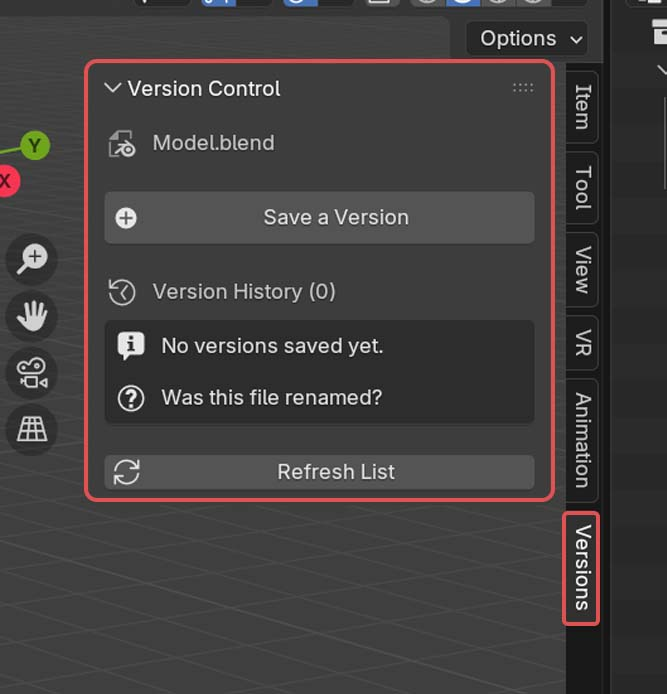
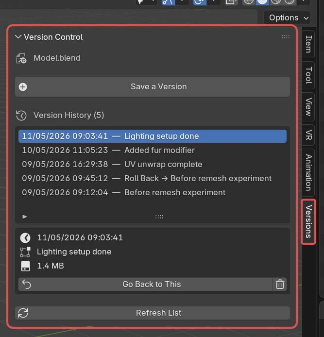

## Version Control for Blender

A Git-inspired version control plugin for Blender, designed for 3D artists —
no Git knowledge required.

> Originally developed as a Final Project for ITCS373 Creative Programming,  
> Faculty of ICT, Mahidol University.

### Features
- Save a version of your `.blend` file with a description and timestamp
- Browse full version history with timestamps, descriptions, and file sizes
- Roll back to any previous version (with an automatic safety snapshot)
- Delete old versions to free up disk space
- Version history stored in a `.bvc/versions/` folder next to your `.blend` file
- Per-file version history — multiple `.blend` files in the same folder each keep their own separate history

<table>
  <tr>
    <td></td>
    <td></td>
  </tr>
</table>

### Requirements
- Blender 3.0 or later

### Installation
1. Download `blender_version_control.py`
2. In Blender: **Edit → Preferences → Add-ons → Install**
3. Select the downloaded file and enable **"Version Control"**
4. Open the **Versions** tab in the 3D Viewport sidebar (press **N**)

### What's Next
- (v0.3.0) Ability to save versions with packed textures
- (v0.4.0) Ability to rename versions to match the current working file